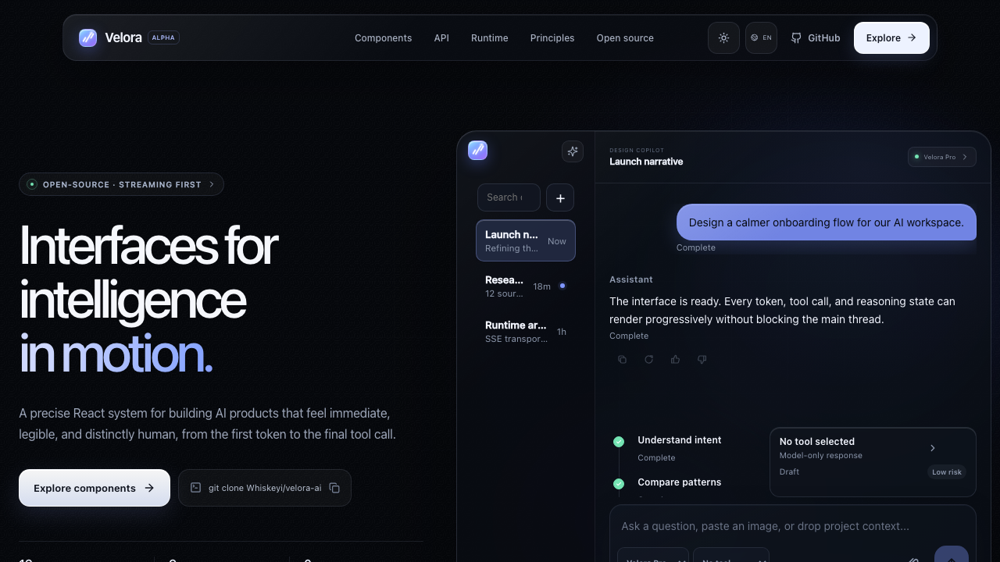
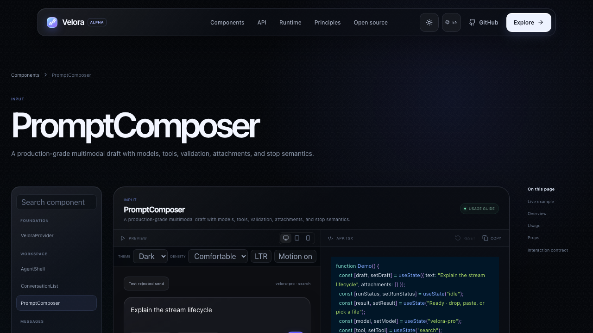
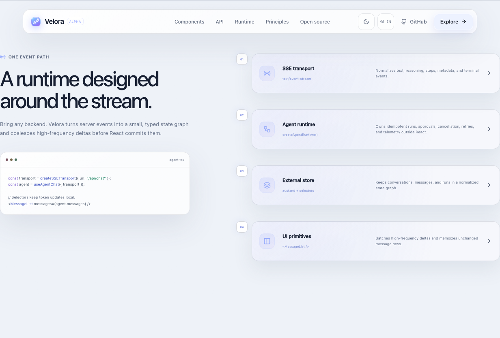

# Velora AI

[English](README.md) | [Chinese](README.zh-CN.md)

[](https://github.com/Whiskeyi/velora-ai/actions/workflows/ci.yml)
[](https://github.com/Whiskeyi/velora-ai/actions/workflows/pages.yml)
[](LICENSE)

Streaming-first React primitives for real AI and agent interfaces.

Velora is a component library rather than a fixed chat template. It separates a provider-neutral event/runtime layer from composable interaction primitives: applications own provider mapping, persistence, uploads, authorization, and business state; Velora supplies the difficult UI mechanics around streaming, drafts, messages, approvals, rich output, accessibility, and responsive agent layouts.

The repository contains the publishable `@velora-ai/react` package and a live-editable component workbench.

[Explore the live component workbench](https://ai.components.zhuchj.com/) · [Read the package API guide](packages/react/README.md)

## Preview

[](https://ai.components.zhuchj.com/)

| Live component API and editor | Light-mode runtime architecture |
| --- | --- |
| [](https://ai.components.zhuchj.com/components/prompt-composer/) | [](https://ai.components.zhuchj.com/#runtime) |

The documentation site now separates the live component workbench from a component API reference. The home page keeps a compact component index, while every primitive has an addressable `/components/<component>/` detail page with a live editor, API table, interaction contract, and responsive navigation.

The site follows the system color scheme on first visit and offers a persistent light/dark switch in the navigation. The live workbench can override theme, density, direction, and reduced motion independently, so every component contract is inspectable without changing the surrounding documentation.

## Recommended composition

- `VeloraProvider` owns theme tokens, density, motion, semantic classes, and global `en-US` / `zh-CN` component messages.
- `ConversationList` with `usePromptDrafts` owns session switching and isolated drafts.
- `MessageList`, `MessageBubble`, and `MarkdownRenderer` own streaming messages, rich output, and reading position.
- `PromptComposer` owns multimodal drafts, attachments, preflight, submission acceptance, and stopping.
- `AgentSteps`, `ReasoningPanel`, and `ToolCallCard` own steps, reasoning disclosure, and tool approval.

Treat submission acceptance and stream completion as separate states. `chat.send()` synchronously returns accepted or rejected; an accepted run exposes `completion` for terminal side effects. Do not keep the composer pending until the entire SSE stream finishes.

## What is included

| Area                | Public API                                                                                   |
| ------------------- | -------------------------------------------------------------------------------------------- |
| Layout and theme    | `AgentShell`, `VeloraProvider`                                                               |
| Sessions and drafts | `ConversationList`, `usePromptDrafts`                                                        |
| Conversation        | `MessageList`, `MessageBubble`, `MessageActions`, `MessageBranchNavigator`, `PromptComposer` |
| Agent process       | `ReasoningPanel`, `AgentSteps`, `ToolCallCard`, `StreamingIndicator`                         |
| Rich output         | `MarkdownRenderer`, `CodeBlock`, `Formula`, `MermaidDiagram`                                 |
| Runtime             | `useAgentChat`, isolated Zustand store, reconnectable SSE and deterministic mock transports  |

The runtime normalizes `start`, text/reasoning deltas, steps, tool calls,
messages, metadata, recoverable warnings, and terminal events.

Pure adapters can be imported without crossing a client boundary:

```ts
import { createSSETransport } from "@velora-ai/react/transport";
import { createAgentStore } from "@velora-ai/react/runtime";
```

## Run the workbench

Requires Node.js 20.19+, 22.18+, or 24.11+ and [Vite+](https://viteplus.dev/).

```bash
vp install
vp dev
```

Open `http://localhost:3000`. The main demo uses `/api/demo/stream`, a real `text/event-stream` route. Every component example can be edited and recompiled in place.

## GitHub Pages

The repository deploys the component workbench from `main` with the official GitHub Pages Actions flow. The Pages build uses Vite+ with relative asset paths so it remains valid under the `/velora-ai/` project subpath.

```bash
npm run build:pages
```

The static build is written to `dist-pages/`. Because GitHub Pages cannot host the server-side SSE route, that deployment switches the showcase to Velora's deterministic mock transport while preserving the same typed runtime, incremental tokens, reasoning, steps, stop, and retry behavior. Product integrations should continue to use `createSSETransport`.

## Package quick start

```bash
npm install @velora-ai/react
```

```tsx
"use client";

import { useState } from "react";
import {
  MessageList,
  PromptComposer,
  VeloraProvider,
  createSSETransport,
  useAgentChat,
  type PromptDraft,
  type PromptSubmitResult,
} from "@velora-ai/react";
import "@velora-ai/react/styles.css";
// Add only when rendering formulas or math-enabled Markdown.
import "@velora-ai/react/rich-content.css";

const transport = createSSETransport({ url: "/api/agent" });

export function AgentSurface() {
  const chat = useAgentChat({ transport, conversationId: "product-copilot" });
  const [draft, setDraft] = useState<PromptDraft>({ text: "", attachments: [] });

  const submit = (nextDraft: PromptDraft): PromptSubmitResult => {
    const result = chat.send(nextDraft.text, {
      attachments: nextDraft.attachments.map(({ id, file }) => ({
        id,
        name: file.name,
        mimeType: file.type,
        size: file.size,
      })),
    });
    if (!result.accepted) {
      return { accepted: false, error: `Message rejected: ${result.reason}` };
    }

    // Acceptance is synchronous. Observe completion separately only when the
    // product needs a terminal workflow side effect.
    void result.completion.then(({ outcome }) => {
      console.info("Agent run settled", outcome);
    });
    return { accepted: true };
  };

  return (
    <VeloraProvider theme="system">
      <MessageList messages={chat.messages} />
      <PromptComposer
        draft={draft}
        onDraftChange={setDraft}
        onSubmit={submit}
        runStatus={chat.isStreaming ? "streaming" : chat.status === "error" ? "error" : "idle"}
        onStop={() => {
          chat.stop();
        }}
      />
    </VeloraProvider>
  );
}
```

The important boundary is acceptance versus completion: `chat.send()` immediately returns `{ accepted: false, reason }` or an accepted run containing IDs and `completion: Promise<AgentRunOutcome>`. The composer clears after acceptance; streaming and stopping are driven by `runStatus`, while message deltas update through the store. Holding prompt submission open until completion produces the wrong interaction.

For text, files, and per-session drafts, use the full draft contract:

```tsx
import {
  PromptComposer,
  createSSETransport,
  useAgentChat,
  usePromptDrafts,
  type PromptDraft,
  type PromptSubmitResult,
} from "@velora-ai/react";

const workspaceTransport = createSSETransport({ url: "/api/agent" });

function WorkspaceComposer({ activeId }: { activeId: string }) {
  const chat = useAgentChat({ transport: workspaceTransport, conversationId: activeId });
  const { getDraft, setDraft, clearDraft, clearAllDrafts } = usePromptDrafts();

  const submit = (draft: PromptDraft): PromptSubmitResult => {
    const result = chat.send(draft.text, {
      attachments: draft.attachments.map(({ id, file }) => ({
        id,
        name: file.name,
        mimeType: file.type,
        size: file.size,
      })),
    });
    return result.accepted
      ? { accepted: true }
      : { accepted: false, error: `Message rejected: ${result.reason}` };
  };

  return (
    <>
      <PromptComposer
        draft={getDraft(activeId)}
        onDraftChange={(next) => setDraft(activeId, next)}
        onSubmit={submit}
        runStatus={chat.isStreaming ? "streaming" : chat.status === "error" ? "error" : "idle"}
        onStop={() => {
          chat.stop();
        }}
        accept="image/*,.pdf"
        maxFileSize={10 * 1024 * 1024}
      />
      <button type="button" onClick={() => clearDraft(activeId)}>
        Discard draft
      </button>
      <button type="button" onClick={clearAllDrafts}>
        Discard all drafts
      </button>
    </>
  );
}
```

`clearDraft(id)` discards one conversation's text and attachments; `clearAllDrafts()` is useful when a workspace or account closes. File bytes are intentionally outside the transport's JSON request—upload them through the product layer and map ready prompt attachments to durable `AgentAttachment` references.

## Interaction contracts

- `MessageList` follows streaming growth only while the reader remains near the bottom. Scrolling upward preserves reading position, accumulates new activity, and exposes “jump to latest”. Pass `conversationKey` when the dataset changes so scroll/activity state resets with the session. For long histories, `windowing={{ threshold: 200 }}` renders an estimated viewport with overscan.
- `MessageActions` provides copy, regenerate, edit, like/dislike, async locks, rollback, and announcements. `MessageBranchNavigator` selects a zero-based response version with buttons or arrow/Home/End keys. Applications own the actual message mutation and branch data.
- `ToolCallCard` models approval-required, running, complete, failed, cancelled, and retry states with risk labels and guarded async actions. UI approval never replaces server-side authorization and policy checks.
- `ReasoningPanel` separates disclosure from run status and elapsed time. `AgentSteps` renders immutable step state, auto-expands active/error detail, measures duration, and guards retry actions.
- `CodeBlock` provides copy, wrapping, collapse, download, cancellable async highlighting, fallback, and retry. `MermaidDiagram` provides lazy rendering, zoom/reset, source copy, strict security configuration, caching, and render retry.
- `MarkdownRenderer` defers expensive streaming work, keeps incomplete Mermaid fences stable, skips raw HTML by default, and composes GFM, KaTeX, code, and diagrams.

See the package [usage and API guide](packages/react/README.md), [streaming protocol](docs/streaming-protocol.md), [architecture](docs/architecture.md), and [performance contract](docs/performance.md).

## Safety, performance, and accessibility

- A consumer highlighter's `{ html }` result is trusted HTML; return React nodes or sanitize untrusted provider/model/user output first. Mermaid's security-sensitive configuration remains locked to strict defaults.
- Preserve message and step object identity for unchanged entities and keep `renderMessage` stable. Streaming deltas are batched at 16 ms by default; completed rows are memoized away from active token updates.
- Mermaid loads on demand. Rich parsing stays outside prompt keystrokes, and long histories should be windowed at the render boundary rather than truncated from source state.
- Interactive primitives include accessible names, keyboard behavior, status/error live regions, visible focus, and reduced-motion handling. `AgentShell` drawers trap focus, inert the background, close predictably, and use container—not viewport—breakpoints.
- Components expose stable `vl-*` classes, typed semantic slots, and CSS token theming without injecting styles from JavaScript.

## Runtime adapter

```ts
const transport = createSSETransport({
  url: "/api/agent",
  maxReconnectAttempts: 3,
  connectTimeoutMs: 15_000,
  headers: () => ({ Authorization: "Bearer …" }),
  parseEvent(frame) {
    return frame.event === "token"
      ? { type: "text-delta", delta: JSON.parse(frame.data).text }
      : null;
  },
});
```

Reconnects carry the latest SSE `id` through `Last-Event-ID`; enable them only
for endpoints that deduplicate the automatically supplied `requestId` /
`Idempotency-Key`. `useAgentChat` also accepts `prepareRequestMessages` for
token-window truncation/provider mapping and `onWarning` for non-terminal
stream errors. Provider requests receive a safe message projection rather than
the UI's reasoning, step, branch, and diagnostic state.

`createAgentRuntime` owns active runs outside React so routing or multiple panes
do not accidentally abort work. `createMockTransport` uses the same
`AgentTransport` contract for deterministic component tests and demos.

## Quality commands

```bash
vp check
vp test run
vp pack
npm run verify:package
npm run verify:api-docs
npm run verify:showcase
vp build
npm run verify:site-css
npm run build:pages
npm run verify:bundle
npm run test:e2e
```

## Repository layout

```text
app/                              workbench and simulated SSE route
packages/react/src/components/   public interaction primitives
packages/react/src/runtime/      transport, protocol, store, and React hook
examples/                        runnable SSE and tool-approval integrations
docs/                             architecture and performance contracts
```

Velora is MIT licensed. Read [CONTRIBUTING.md](CONTRIBUTING.md) and [SECURITY.md](SECURITY.md) before proposing changes.
