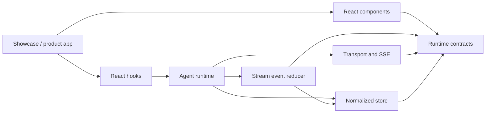

# Architecture

Velora separates protocol, state, orchestration, React bindings, and
presentation. A product can replace its transport or UI without rewriting the
runtime, and server code can use the headless entry without pulling React into
the dependency graph.

## Layer map

The arrows below mean “may depend on”. Dependencies only move from the outer
layers toward stable inner contracts.

| Layer | Source | Owns | Must not own |
| --- | --- | --- | --- |
| Contracts | `runtime/types.ts` | Messages, events, request and tool types | I/O, React, mutable state |
| Wire | `runtime/abort.ts`, `sse.ts`, `transport.ts`, `mock.ts` | Abort semantics, SSE decoding, provider adapters | UI state or React |
| State | `runtime/store.ts`, `persistence.ts` | Normalized entities, selectors, persistence | Network requests |
| Event reduction | `runtime/stream-events.ts` | Deterministic event-to-state transitions | Stream iteration or component effects |
| Orchestration | `runtime/agent-runtime.ts` | Run lifecycle, batching, cancellation and callbacks | JSX or hook lifecycle |
| React adapter | `runtime/use-agent-chat.ts` | Runtime subscription and hook ergonomics | Transport parsing |
| Components | `components/` | Accessible interaction and presentation | Request orchestration |
| Showcase | `app/`, `app/showcase/` | Documentation, examples and live editor composition | Private package imports |

These contracts are checked by `npm run verify:architecture`. The verifier
rejects source cycles, illegal runtime edges, component imports that bypass
`runtime/types.ts`, server routes that import the client root, and accidental
React dependencies in server-safe entrypoints.

## Public entrypoints

Use the narrowest entrypoint that matches the caller:

| Import | Environment | Purpose |
| --- | --- | --- |
| `@velora-ai/react` | Client | Convenience entry for components, hooks and runtime |
| `@velora-ai/react/components` | Client | UI primitives only |
| `@velora-ai/react/hooks` | Client | React adapters only |
| `@velora-ai/react/runtime` | Server or client | Headless runtime, store and public contracts |
| `@velora-ai/react/transport` | Server or client | SSE and mock transports |
| `@velora-ai/react/rich-content/*` | Client | Independently loadable code, formula, Markdown or Mermaid renderer |

Server handlers should import public request and event types from
`@velora-ai/react/runtime`, never from the client convenience entry.

## Data flow

`AgentTransport` exposes one operation: stream a typed `ChatRequest` as an
`AsyncIterable<AgentStreamEvent>`. `createSSETransport` adapts a real fetch
endpoint. `createMockTransport` follows the same contract for examples, tests,
and prototypes. The React hook consumes either transport and commits normalized
changes to the store. Components subscribe only to the slices they render.

Events distinguish assistant text, reasoning, steps, typed tool calls, metadata,
recoverable warnings, terminal usage, and failures. This prevents UI code from
parsing provider-specific payloads and makes abort/retry behavior deterministic.
`applyAgentStreamEvent` performs the deterministic event transition; the runtime
is responsible only for consuming the stream and scheduling commits.
`createAgentRuntime` owns requests independently of React; `useAgentChat`
subscribes a view to one conversation and does not stop a run merely because
that view unmounts.

## State ownership

- A composer owns only ephemeral draft and composition state unless `value` is
  controlled by its parent.
- Conversation and message state belongs to a per-runtime Zustand vanilla
  store. There is no process-wide singleton.
- Presentation state such as an expanded reasoning panel stays local or follows
  the component's controlled prop.
- Server data is represented as JSON-safe readonly values. Store actions create
  new references only for entities that changed.

## Component contracts

Public components use `forwardRef`, native element props where safe, explicit
event payloads, and semantic styling slots. Consumers can style stable regions
such as `root`, `content`, or `actions` without relying on private DOM order.
Every interactive primitive has a keyboard path, an accessible name, visible
focus, and a reduced-motion fallback.

## Rendering strategy

- Message rows are memoized by identity; appending a delta does not invalidate
  completed siblings.
- Long conversations can opt into estimated, overscanned `MessageList`
  windowing without truncating runtime state.
- Streaming Markdown defers expensive parsing and isolates code, math, and
  diagram renderers.
- Mermaid loads on demand and caches the source-to-diagram result.
- Auto-scroll follows the stream only while the reader remains near the end;
  manually scrolling upward transfers control back to the reader.
- Store selectors are intentionally narrow. Consumers should select IDs first,
  then subscribe to individual entities.

## Styling and theming

`VeloraProvider` publishes design tokens through CSS custom properties. The
default theme is neutral and product-safe; the showcase composes those tokens
into a more expressive liquid-glass surface. Velora-owned CSS selectors use
the `vl-` prefix and never target consumer element names globally. Base
component styles do not load KaTeX fonts; products that render formulas opt
into `@velora-ai/react/rich-content.css` separately.

## Maintainer rules

- Add new protocol fields to `runtime/types.ts` before implementing adapters.
- Keep provider-specific payload decoding inside a transport adapter.
- Express state transitions in `stream-events.ts`; keep stream scheduling and
  callbacks in `agent-runtime.ts`.
- Components may import runtime contracts, but never the store, runtime, or
  transport implementation.
- Put browser lifecycle logic behind a hook. The showcase keeps locale
  persistence in `app/showcase/use-showcase-locale.ts`, route construction in
  `app/showcase/routing.ts`, optional heavy modules in
  `app/showcase/lazy-components.ts`, deterministic data in
  `app/showcase/demo-fixtures.ts`, and transport selection in
  `app/showcase/demo-transport.ts`.
- Update `scripts/verify-architecture.mjs` when a layer is intentionally added.
  Do not weaken a rule to accommodate a one-off import.
